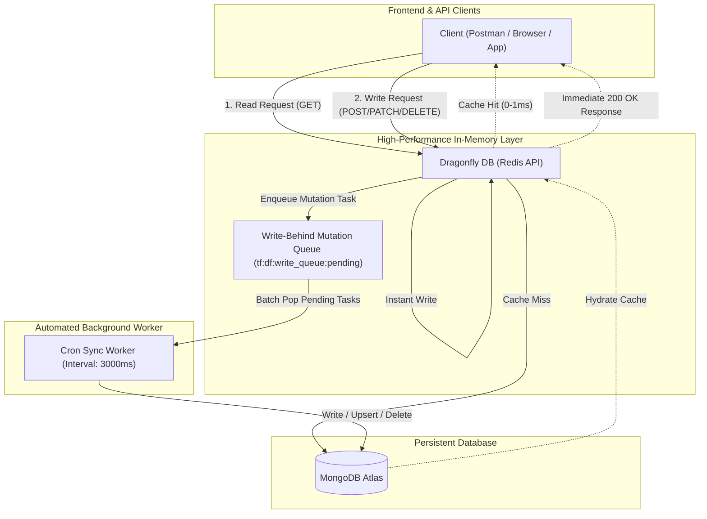

# TalentFlow API, Dragonfly DB & JWT Complete Documentation

The **TalentFlow API** is the high-performance backend REST API service powering the TalentFlow monorepo ecosystem (Admin Panel, Company Workspace, Candidate Portal, and Graviton Solutions). It is built with **Node.js, Express, TypeScript, Passport.js, Dragonfly DB / Redis (In-Memory Primary Store), MongoDB Atlas (Persistent Store with Background Cron Sync)**, and **JSON Web Tokens (JWT)**.

---

## 🚀 Architecture: Dragonfly-First + MongoDB Cron Sync



### Core Architecture Principles:

1. **Strict Dragonfly Read-Through**:
   - Every read operation (Candidates, Companies, Jobs, Settings, Users, Stats) strictly checks **Dragonfly DB first**.
   - If present in Dragonfly DB, the result is returned in **sub-millisecond (< 1ms)** latency without hitting MongoDB.
   - If and only if the key is missing in Dragonfly DB, it fetches from **MongoDB Atlas**, immediately stores/hydrates the data into Dragonfly DB, and returns.

2. **Strict Dragonfly Write-First + Background Cron Job**:
   - All write/update/delete operations write **directly and strictly into Dragonfly DB first**.
   - The write operation is immediately enqueued into the **Dragonfly Write-Behind Queue (`tf:df:write_queue:pending`)**.
   - A dedicated **Background Cron Worker** (running every 3 seconds) continuously drains this queue in batches and writes the data to **MongoDB Atlas**.
   - Provides instantaneous API response times while guaranteeing eventual consistency and persistent durability in MongoDB.

---

## Table of Contents

1. [Dragonfly DB Architecture & Cron Sync](#dragonfly-db-architecture--cron-sync)
2. [JWT Authentication Overview](#jwt-authentication-overview)
3. [Environment Configuration](#environment-configuration)
4. [Role-Based Access Control](#role-based-access-control)
5. [Complete API Endpoints Directory](#complete-api-endpoints-directory)
   - [1. System & Health Check](#1-system--health-check)
   - [2. Authentication & JWT Management](#2-authentication--jwt-management)
   - [3. Platform Admin & Cron Sync](#3-platform-admin--cron-sync)
   - [4. Candidate Portal](#4-candidate-portal)
   - [5. Company Workspace Portal](#5-company-workspace-portal)
   - [6. Job Postings & ATS](#6-job-postings--ats)
   - [7. Graviton Solutions & Leads](#7-graviton-solutions--leads)
   - [8. Application Settings](#8-application-settings)
6. [Testing the APIs with cURL / Postman](#testing-the-apis-with-curl--postman)

---

## JWT Authentication Overview

TalentFlow uses stateless **JSON Web Tokens (JWT)** signed via HMAC-SHA256 (`HS256`) for secure client-server authorization, coupled with Dragonfly DB in-memory cache for fast session invalidation.

- **Header format**: `Authorization: Bearer <JWT_TOKEN>`
- **Token Expiry**: Default 7 days (`7d`)
- **Secret Key**: Defined via `JWT_SECRET` in `.env`
- **Supported Roles**: `admin`, `company`, `candidate`

---

## Environment Configuration

```env
# Server
PORT=5000
HOST=0.0.0.0
NODE_ENV=development

# JWT & Session
JWT_SECRET=talentflow_super_secret_jwt_key_2026_production
SESSION_SECRET=talentflow_session_secret_2026_secure

# Database & Dragonfly In-Memory Datastore
MONGODB_URI=mongodb://127.0.0.1:27017/talentflow
MONGODB_DATABASE=talentflow
DRAGONFLY_HOST=127.0.0.1
DRAGONFLY_PORT=6379

# Admin Credentials
ADMIN_EMAIL=admin@talentflow.io
ADMIN_PASSWORD=Admin@1234
```

---

## Complete API Endpoints Directory

Base URL: `http://localhost:5000`

### 1. System & Health Check

| Method | Endpoint             | Description                                                     | Primary Engine    |
| :----- | :------------------- | :-------------------------------------------------------------- | :---------------- |
| `GET`  | `/api/health`        | System readiness, MongoDB, Dragonfly DB, and Auth engine status | Dragonfly + Mongo |
| `GET`  | `/api/system-health` | Alias for `/api/health`                                         | Dragonfly + Mongo |

---

### 2. Authentication & JWT Management

Routes: `/api/auth/*` (Aliases: `/api/candidates-auth/*`, `/api/companies-auth/*`, `/api/admin-auth/*`)

| Method | Endpoint                     | Description                                                    | Request Body / Query                                    |
| :----- | :--------------------------- | :------------------------------------------------------------- | :------------------------------------------------------ |
| `POST` | `/api/auth/signup`           | Register Candidate or Company in Dragonfly DB & queue for Cron | `{ email, password, fullName, role }`                   |
| `POST` | `/api/auth/signup-details`   | Full multi-step onboarding registration                        | `{ email, password, fullName, role, companyName, ... }` |
| `POST` | `/api/auth/signin`           | Sign in (reads strictly from Dragonfly first) & returns JWT    | `{ email, password }`                                   |
| `POST` | `/api/auth/google`           | Google OAuth One-Tap / Social authentication                   | `{ email, fullName, googleId, avatarUrl, role }`        |
| `GET`  | `/api/auth/me`               | **Validate JWT & get current user profile from Dragonfly DB**  | Header: `Authorization: Bearer <token>`                 |
| `POST` | `/api/auth/signout`          | Invalidate token and session in Dragonfly DB                   | Header: `Authorization: Bearer <token>`                 |
| `GET`  | `/api/auth/session/validate` | Check if session token or JWT is active in Dragonfly DB        | Header: `Authorization` or `session-id`                 |
| `POST` | `/api/auth/verify-email`     | Dispatch verification email                                    | `{ email }`                                             |
| `GET`  | `/api/auth/check-verified`   | Check verification status in Dragonfly DB                      | `?email=user@example.com`                               |
| `POST` | `/api/auth/update-email`     | Update email in Dragonfly DB & queue for MongoDB               | `{ currentEmail, newEmail }`                            |
| `POST` | `/api/auth/otp/send`         | Send 6-digit OTP code                                          | `{ destination }`                                       |
| `POST` | `/api/auth/otp/verify`       | Verify OTP code                                                | `{ userEnteredOtp, expectedOtp }`                       |

---

### 3. Platform Admin & Cron Sync

Routes: `/api/admin/*` (Aliases: `/api/admin-portal/*`, `/api/admin-panel/*`)

| Method | Endpoint                    | Description                                              | Storage                 |
| :----- | :-------------------------- | :------------------------------------------------------- | :---------------------- |
| `GET`  | `/api/admin/stats`          | Platform statistics (total companies, candidates, jobs)  | Dragonfly DB            |
| `GET`  | `/api/admin/settings`       | Get global platform configuration                        | Dragonfly DB            |
| `POST` | `/api/admin/settings`       | Update global settings in Dragonfly & queue for MongoDB  | Dragonfly -> Mongo Cron |
| `GET`  | `/api/admin/sync/status`    | **View live Dragonfly -> MongoDB Cron Sync queue stats** | Dragonfly DB            |
| `POST` | `/api/admin/sync/trigger`   | **Force flush / immediately execute Cron Sync queue**    | Dragonfly -> Mongo      |
| `GET`  | `/api/admin/health`         | Detailed backend status and operational metrics          | Live                    |
| `GET`  | `/api/admin/audit-logs`     | Retrieve platform audit trail                            | Live                    |
| `POST` | `/api/admin/cache/clear`    | Clear Dragonfly DB cache by pattern                      | Dragonfly DB            |
| `POST` | `/api/admin/session/revoke` | Revoke an active session                                 | Dragonfly DB            |

---

### 4. Candidate Portal

Routes: `/api/candidates/*`

| Method   | Endpoint                                | Description                                     | Storage Strategy                  |
| :------- | :-------------------------------------- | :---------------------------------------------- | :-------------------------------- |
| `GET`    | `/api/candidates`                       | List all candidates                             | Dragonfly First -> Mongo Fallback |
| `POST`   | `/api/candidates`                       | Save candidate in Dragonfly DB & queue for Cron | Dragonfly Write -> Mongo Cron     |
| `GET`    | `/api/candidates/:id`                   | Get candidate profile by ID                     | Dragonfly First -> Mongo Fallback |
| `GET`    | `/api/candidates/search/email`          | Search candidate by email                       | Dragonfly First -> Mongo Fallback |
| `POST`   | `/api/candidates/:id/add-company`       | Link company to candidate                       | Dragonfly Write -> Mongo Cron     |
| `GET`    | `/api/candidates/:candidateId/settings` | Get candidate settings                          | Dragonfly First -> Mongo Fallback |
| `POST`   | `/api/candidates/:candidateId/settings` | Save candidate settings                         | Dragonfly Write -> Mongo Cron     |
| `DELETE` | `/api/candidates/:id`                   | Delete candidate profile                        | Dragonfly Delete -> Mongo Cron    |

---

### 5. Company Workspace Portal

Routes: `/api/companies/*`

| Method | Endpoint                                       | Description                                   | Storage Strategy                  |
| :----- | :--------------------------------------------- | :-------------------------------------------- | :-------------------------------- |
| `GET`  | `/api/companies`                               | List all companies                            | Dragonfly First -> Mongo Fallback |
| `POST` | `/api/companies`                               | Save company in Dragonfly DB & queue for Cron | Dragonfly Write -> Mongo Cron     |
| `GET`  | `/api/companies/:id`                           | Get company by ID or subdomain                | Dragonfly First -> Mongo Fallback |
| `GET`  | `/api/companies/search/email`                  | Search company by email                       | Dragonfly First -> Mongo Fallback |
| `POST` | `/api/companies/:companyId/register-candidate` | Enroll candidate to company                   | Dragonfly Write -> Mongo Cron     |
| `GET`  | `/api/companies/:companyId/settings`           | Get company settings                          | Dragonfly First -> Mongo Fallback |
| `POST` | `/api/companies/:companyId/settings`           | Save company settings                         | Dragonfly Write -> Mongo Cron     |
| `POST` | `/api/companies/schedule-credentials-email`    | Schedule credentials email                    | Dragonfly DB                      |

---

### 6. Job Postings & ATS

Routes: `/api/jobs/*`

| Method   | Endpoint                       | Description               | Storage Strategy                  |
| :------- | :----------------------------- | :------------------------ | :-------------------------------- |
| `GET`    | `/api/jobs`                    | Retrieve all job listings | Dragonfly First -> Mongo Fallback |
| `POST`   | `/api/jobs`                    | Create new job opening    | Dragonfly Write -> Mongo Cron     |
| `GET`    | `/api/jobs/company/:companyId` | Retrieve company jobs     | Dragonfly First -> Mongo Fallback |
| `GET`    | `/api/jobs/:id`                | Get job by ID             | Dragonfly First -> Mongo Fallback |
| `PATCH`  | `/api/jobs/:id/status`         | Update job status         | Dragonfly Write -> Mongo Cron     |
| `DELETE` | `/api/jobs/:id`                | Delete a job opening      | Dragonfly Delete -> Mongo Cron    |

---

### 7. Graviton Solutions & Leads

Routes: `/api/graviton/*`

| Method | Endpoint               | Description                                  |
| :----- | :--------------------- | :------------------------------------------- |
| `GET`  | `/api/graviton/health` | Graviton microservices health                |
| `POST` | `/api/graviton/leads`  | Capture prospective client consultation lead |

---

### 8. Application Settings

Routes: `/api/settings/*`

| Method | Endpoint                               | Description                | Storage Strategy                  |
| :----- | :------------------------------------- | :------------------------- | :-------------------------------- |
| `GET`  | `/api/settings/admin`                  | Global Admin Settings      | Dragonfly First -> Mongo Fallback |
| `POST` | `/api/settings/admin`                  | Save Admin Settings        | Dragonfly Write -> Mongo Cron     |
| `GET`  | `/api/settings/company/:companyId`     | Company workspace settings | Dragonfly First -> Mongo Fallback |
| `POST` | `/api/settings/company/:companyId`     | Save company settings      | Dragonfly Write -> Mongo Cron     |
| `GET`  | `/api/settings/candidate/:candidateId` | Candidate settings         | Dragonfly First -> Mongo Fallback |
| `POST` | `/api/settings/candidate/:candidateId` | Save candidate settings    | Dragonfly Write -> Mongo Cron     |

---

## 🧪 Testing the APIs with cURL

#### 1. Test Dragonfly -> MongoDB Cron Sync Status

```bash
curl -X GET http://localhost:5000/api/admin/sync/status
```

#### 2. Sign In to Obtain a JWT Token

```bash
curl -X POST http://localhost:5000/api/auth/signin \
  -H "Content-Type: application/json" \
  -d '{
    "email": "admin@talentflow.io",
    "password": "Admin@1234"
  }'
```

#### 3. Verify Token & Fetch Profile from Dragonfly DB (`GET /api/auth/me`)

```bash
export TOKEN="YOUR_JWT_TOKEN"

curl -X GET http://localhost:5000/api/auth/me \
  -H "Authorization: Bearer $TOKEN"
```

#### 4. Create a Job in Dragonfly DB (Auto-Queued for MongoDB Cron Sync)

```bash
curl -X POST http://localhost:5000/api/jobs \
  -H "Content-Type: application/json" \
  -H "Authorization: Bearer $TOKEN" \
  -d '{
    "title": "Staff Platform Engineer",
    "companyId": "comp-acme-corp",
    "companyName": "Acme Corp",
    "department": "Engineering",
    "location": "Remote",
    "salary": "$170,000 - $220,000",
    "status": "published"
  }'
```

#### 5. Force Flush Cron Sync Queue Immediately

```bash
curl -X POST http://localhost:5000/api/admin/sync/trigger \
  -H "Authorization: Bearer $TOKEN"
```
